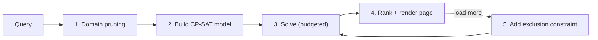

# Engine spec — armor set search

The search engine is a **constraint-satisfaction model solved with Google OR-Tools CP-SAT**.
It is a behavioral port of the legacy ASS pipeline (prune → match → decorate), *not* a port of
its brute-force structure. Read `docs/legacy-analysis/overview.md` for what we are replacing
and why.

One engine serves all generations; per-generation differences arrive as **game-pack data +
feature flags** (`docs/specs/data-pack-spec.md`). The behavioral ceiling is MHGU (charms,
Charm Up, Skill +2, compound skills); every other game is a subset.

## Definitions

- **Skill tree** (legacy: "ability"): a named point pool, e.g. `Attack`. Armor, charms, and
  decorations grant signed points to trees.
- **Skill**: a threshold on a tree, e.g. `Attack Up (L)` = 20 points in `Attack`. Thresholds
  can be negative (bad skills).
- **Query**: the user's request — desired skills, filters (HR, village★, gender, hunter type,
  rarity, event gear), weapon slots, charm policy, result options.

## Pipeline

### 1. Domain pruning (pre-solve, deterministic)

Port of the legacy `GetRelevantData` idea, without its O(n²) implementation:

1. **Relevance filter** — drop armor pieces and decorations that grant no points to any
   requested tree *and* have below-maximum slot counts. (A piece with 3 slots is always
   relevant: slots are generic currency.)
2. **Hard filters** — gender, hunter type, HR/village★ ceiling, event-gear flag, per-game
   exclusions from the query.
3. **Dominance prune** — piece A dominates piece B (same slot) if A ≥ B on every requested
   tree and on slot count, with at least one strict. Dominated pieces leave the domain.
   Implement with sorted scans or a skyline pass, not pairwise O(n²) list scans.
4. **Equivalence collapse** (from MHFU) — pieces identical on (slot count, vector of requested
   tree points, torso-Inc flag) collapse to one **representative**; the full member list is
   kept for result expansion. This shrinks solver domains without losing any distinct result.

Pruning must be **pure and cached per (game, query-skill-set, filters)** — the same skill
combination re-pruned on every request is wasted work.

### 2. CP-SAT model

Decision variables per candidate set:

| Variables | Domain | Notes |
|---|---|---|
| `head, body, arms, waist, legs` | pruned representatives per slot | one index variable per slot |
| `charm` | user inventory ∪ generated legal charms ∪ {none} | absent when pack flag `talismans: false` |
| `deco_count[d]` | 0..K per relevant decoration d | how many of each jewel are socketed |
| `weapon_slots` | 0..3 | from the query, a constant |
| `torso_inc` | bool | true iff the chosen body piece has Torso Inc |

Derived expressions:

- `points[t]` per requested tree = Σ piece skills + charm skills (+ `charm_up` doubling where
  the pack defines it) + Σ `deco_count[d] · deco_points[d,t]`, with body contribution and
  body-socketed decorations multiplied by 2 when `torso_inc`.
- `slots_used[s]` for s ∈ {1,2,3} = Σ over decorations of `deco_count[d]` where deco size = s,
  plus larger jewels may occupy larger slots (a size-1 jewel fits a size-3 slot): model with
  capacity constraints over cumulative slot buckets.

Hard constraints:

- `points[t] ≥ threshold[t]` for every requested skill.
- Slot capacity: total decoration size assignments ≤ available slots
  (weapon + armor + charm), per size bucket with downward fill allowed.
- **No bad skills** (default): for every tree with a negative threshold, `points[t] > negative
  threshold` unless the query allows bad skills.
- Exactly one piece per armor slot; at most one charm.
- Charm legality: generated charms must satisfy the pack's charm-table constraints (max points
  per tree, 1- vs 2-skill limits, slot ranges) — these come from the pack's charm data, not
  from solver heuristics.

### 3. Objectives (lexicographic, in order)

1. **Minimize required charm strength** — the legacy "charm reduction" heuristic
   (`ReduceCharm`/`ReduceSlots`/`ReduceSkills`) becomes a first-class objective: prefer sets
   completable with the weakest legal charm (or none). This is the single biggest UX upgrade
   over the legacy tool and CP-SAT does it natively.
2. **Maximize spare slots** (post-decoration), then **maximize defense**.
3. Tie-breakers from the query's sort option (resists, rarity, difficulty).

### 4. Enumeration — iterate + exclude

- Each solve returns **one** ranked set. The results page shows the first page (default 10).
- "Load more" re-solves with an **exclusion constraint** per already-shown set
  (`¬(head=hᵢ ∧ body=bᵢ ∧ arms=aᵢ ∧ waist=wᵢ ∧ legs=lᵢ ∧ charm=cᵢ)` over representatives).
  On this data size each re-solve is milliseconds; there is no solution pool and no 100k
  result buffer.
- Equivalence representatives are expanded to their member lists **at render time**, so
  "same stats, different look" variants appear as one result with alternates, not as N
  near-duplicate rows.
- Search state (model + exclusions) lives server-side keyed by the anonymous session +
  search id; htmx "load more" posts the search id.

### 5. Budgets and cancellation (hard rules)

- Every solve has a **wall-clock limit** (default 2 s, configurable per deployment) and the
  request handler has an overall deadline. A query that cannot complete within budget returns
  the best sets found so far plus a "partial results" indicator — never a hang.
- Cancellation is request-scoped: client disconnect or a new search from the same session
  invalidates the old search id.
- No unbounded work queues, no background fan-out per charm template, no result accumulation
  beyond the page being served.

### 6. Per-generation model deltas

| Feature | MHFU | MHP3 | MH3U | MH4 | MH4U | MHGen | MHGU |
|---|---|---|---|---|---|---|---|
| Charm variable | — | ✓ | ✓ (+ table filter) | ✓ | ✓ | ✓ | ✓ |
| Charm table selection | — | ✓ | ✓ (17 tables) | — | — | — | — |
| Weapon as search dimension | slots only | slots only | slots only | ✓ (excavated) | ✓ (excavated) | slots only | slots only |
| Excavated/relic gear | — | — | — | ✓ | ✓ | — | — |
| Charm Up (double charm skills) | — | — | — | — | — | — | ✓ |
| Skill +2 mechanic | — | — | — | — | — | — | ✓ |
| Compound skills | — | — | — | ✓ | ✓ | ✓ | ✓ |

All deltas are data/flag-driven; the engine has no per-game code branches beyond reading the
pack's flags.

### 7. Correctness oracle

The legacy tools are the reference implementation. For each game pack, the ETL + engine must
be validated by replaying a fixed suite of known queries (documented per pack in
`docs/specs/data-pack-spec.md`) and checking that set-seeker finds the legacy tool's published
example sets. Divergences are bugs in our model or data, unless traced to a documented legacy
bug (e.g. the weak dedup hash collisions).
