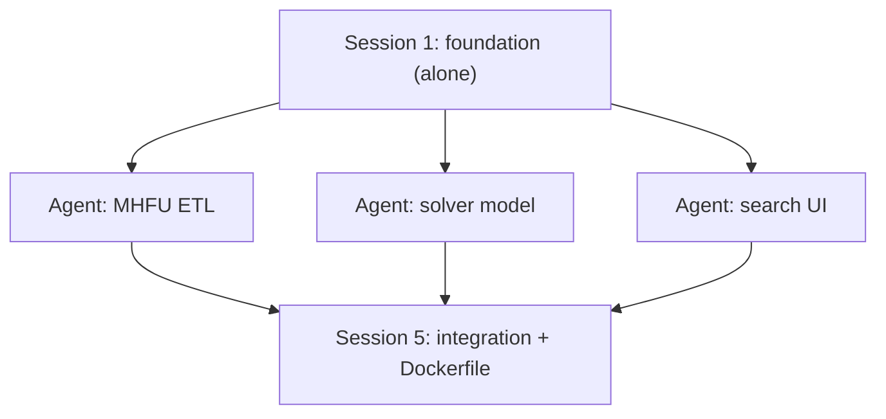

# Phase 0 contracts — parallel-work keystone

> **Historical.** Written so four MHFU agents could work in parallel. Phase 0/1 is
> implemented: treat `app/domain/models.py`, `app/engine/`, and `app/web/` as
> as-built. New generations use `docs/prompts/` (one implementer per SCOPE, then a
> reviewer). Do not re-open this file as a live ownership matrix.

This document was the **single source of truth for interfaces** during the Phase 0 / Phase 1
(MHFU) build. It exists so that foundation, ETL, solver, and UI work can proceed without
negotiating with each other. If code and this document disagree, the code is wrong — or the
disagreement is surfaced and this document is updated deliberately, in one commit.

Execution shape (see chat history / roadmap):



## 1. Repository layout (settled)

```
pyproject.toml                  # ONLY foundation edits this (dependencies are listed in §2)
Dockerfile                      # integration session writes this
alembic/                        # foundation
app/
  __init__.py
  main.py                       # app factory + middleware. ONLY foundation and integration edit
  config.py                     # pydantic-settings: DATABASE_URL, SOLVER_TIME_LIMIT_MS, ...
  db.py                         # SQLAlchemy Core engine/connection factory
  sessions.py                   # anonymous session cookie middleware (ADR 0007)
  domain/
    models.py                   # THE contract dataclasses (§3) — foundation writes verbatim
  repository/
    game_data.py                # read game data (foundation implements fully)
    user_data.py                # sessions, search_states (foundation implements fully)
  engine/
    pruning.py                  # relevance/dominance/equivalence (solver agent)
    solver.py                   # CP-SAT model build + solve (solver agent)
    service.py                  # SearchService: iterate+exclude orchestration (solver agent)
  etl/
    __main__.py                 # python -m app.etl --pack mhfu
    manifest.py                 # pack manifest loading/validation
    column_maps/mhfu.py         # per-pack column map (ETL agent)
    loaders.py                  # CSV/TXT parsing (ETL agent)
    writer.py                   # writes via repository (ETL agent)
  web/
    routes/pages.py             # GET pages (UI agent)
    routes/search.py            # htmx endpoints (UI agent)
    mock.py                     # MockSearchService (UI agent; deleted at integration)
    templates/                  # base.html, index.html, search/* (UI agent)
    static/                     # vendored bootstrap, htmx, alpine (UI agent)
packs/
  mhfu/
    manifest.yaml               # per docs/specs/data-pack-spec.md (ETL agent)
    known_queries.yaml          # validation suite (ETL agent, with user)
tests/
  fixtures/tiny_pack.py         # THE fixture (§6) — solver agent writes verbatim
  engine/  etl/  web/
```

## 2. Dependencies (settled — no agent adds more)

Python **3.12**. `pyproject.toml` contains exactly:

- Runtime: `fastapi`, `uvicorn[standard]`, `jinja2`, `sqlalchemy>=2`, `alembic`,
  `ortools`, `pydantic-settings`, `pyyaml`
- Dev: `pytest`, `httpx`, `ruff`

If work seems to require another dependency, stop and surface it — do not edit
`pyproject.toml` outside the foundation session.

## 3. Domain contract (`app/domain/models.py`, verbatim)

The engine is pure: it sees ids and numbers, never database rows or template types.
Name resolution for rendering happens in the web layer via the repository.

```python
from dataclasses import dataclass


@dataclass(frozen=True)
class SkillRequest:
    tree_id: int
    min_points: int  # activation threshold from the skills table


@dataclass(frozen=True)
class Query:
    game: str  # pack id, e.g. "mhfu"
    skills: tuple[SkillRequest, ...]  # 1..5 entries
    weapon_slots: int  # 0..3
    gender: str  # "m" | "f"
    hunter_type: str  # "blademaster" | "gunner"
    hr: int | None  # None = uncapped
    village_stars: int | None  # None = uncapped
    allow_event: bool = False
    allow_bad_skills: bool = False
    allow_torso_inc: bool = True  # Athena chkTorsoInc defaults checked
    allow_dummy: bool = False
    excluded_piece_ids: tuple[int, ...] = ()
    excluded_decoration_ids: tuple[int, ...] = ()
    forced_piece_ids: tuple[int, ...] = ()
    forced_decoration_ids: tuple[int, ...] = ()
    sort: str = "defense"  # "defense" | "slots" | "rarity" | res_*
    expand_equivalents: bool = False  # list every equivalent set, not grouped alts


@dataclass(frozen=True)
class DecorationAssignment:
    decoration_id: int
    count: int


@dataclass(frozen=True)
class ArmorSetResult:
    # Representative piece ids per slot, order: head, body, arms, waist, legs
    piece_ids: tuple[int, int, int, int, int]
    # Per-slot equivalence-class member ids (includes the representative)
    alternates: tuple[tuple[int, ...], ...]
    decorations: tuple[DecorationAssignment, ...]
    charm_id: int | None  # always None for mhfu (pack flag talismans: false)
    active_skills: tuple[tuple[int, int], ...]  # (skill_id, points achieved)
    spare_slots: tuple[int, int, int]  # remaining size-1/2/3 slots
    defense: int


@dataclass(frozen=True)
class SearchPage:
    search_id: str
    results: tuple[ArmorSetResult, ...]  # len <= PAGE_SIZE
    partial: bool  # solver hit its time budget
    exhausted: bool  # no further solutions exist


PAGE_SIZE = 10
```

## 4. Service contract (`app/engine/service.py`)

```python
from typing import Protocol
from app.domain.models import Query, SearchPage


class SearchService(Protocol):
    def start_search(self, session_id: str, query: Query) -> SearchPage: ...
    def load_more(self, session_id: str, search_id: str) -> SearchPage: ...
```

Semantics:

- `start_search` prunes (cached per `(pack, query)`), persists a pack-standard
  `domain_snapshot` (`inf_ids` / `rel_ids` per slot kind) on `search_states.query_json`,
  builds the CP-SAT model, solves up to `PAGE_SIZE` times with iterate-and-exclude, persists
  solution exclusions in `search_states`, returns page 1.
- Advanced Search is **post-first-search**: the opener stays disabled until
  `POST /games/{game}/search` returns. The modal lists `inf`; default-checked = skyline `rel`.
  Apply maps checks to `excluded_*` / `forced_*` and re-POSTs.
- `load_more` re-loads state, re-solves with stored exclusions, appends new ones.
- Every solve respects `SOLVER_TIME_LIMIT_MS` (default **2000**, from config). On timeout,
  return what exists with `partial=True`. Never raise for infeasible — return
  `exhausted=True` with empty results.
- A second `start_search` from the same session invalidates that session's prior
  `search_states` rows.

## 5. HTTP + template contract (UI agent)

Routes:

| Route | Purpose | Response |
|---|---|---|
| `GET /` | game picker + search form | `index.html` full page |
| `POST /games/{game}/search` | start search | `search/results.html` partial (page 1 + load-more + Advanced OOB) |
| `POST /search/{search_id}/more` | next page | fragment: result cards + updated button (out-of-band) |
| `GET /search/{search_id}/advanced` | Advanced domain lists | `search/_advanced_modal_body.html` |

Template context for `search/results.html` and the `/more` fragment — the web layer resolves
ids to names via `repository.game_data` before rendering:

```python
{
    "search_id": str,
    "results": [
        {
            "pieces": [  # always 5, order head/body/arms/waist/legs
                {
                    "slot": "head",
                    "name": str,
                    "rarity": int,
                    "defense": int,
                    "alternates": [{"id": int, "name": str}],
                }
            ],
            "decorations": [{"name": str, "count": int}],
            "charm": None,  # mhfu: always None
            "active_skills": [{"name": str, "points": int}],
            "spare_slots": [int, int, int],
            "defense": int,
        }
    ],
    "partial": bool,
    "exhausted": bool,
}
```

htmx wiring: the load-more button uses `hx-post="/search/{search_id}/more"`,
`hx-target="#results-list"`, `hx-swap="beforeend"`; the fragment replaces the button itself
via `hx-swap-oob`. Bootstrap cards for results; fully usable at 360 px width. No Tailwind, no
build step, JS limited to vendored htmx + Alpine (ADR 0003).

## 6. The fixture pack (`tests/fixtures/tiny_pack.py`, verbatim)

Solver and UI agents develop against this — **not** against real ETL output. One skill tree
(`Attack`, tree_id 1; threshold `Attack Up (S)` = 10), no charms, no torso Inc, both genders
allowed, all rarities 1, defense = slot index + 1 (arbitrary but deterministic).

```python
HEAD = [(1, 4, 0), (2, 2, 1), (3, 0, 2)]  # (piece_id, attack_pts, slots)
BODY = [(4, 3, 0), (5, 2, 1), (6, 0, 2)]
ARMS = [(7, 3, 1), (8, 1, 2), (9, 0, 0)]
WAIST = [(10, 2, 1), (11, 1, 1), (12, 0, 2)]
LEGS = [(13, 3, 0), (14, 2, 1), (15, 0, 1)]
DECORATIONS = [(101, 1, 1), (102, 2, 3)]  # (deco_id, size, attack_pts)
```

Deterministic assertions the solver agent's tests must encode:

1. The all-first-pieces set (ids 1, 4, 7, 10, 13) yields 15 attack with **zero** decorations.
2. Every returned result for `Attack ≥ 10, weapon_slots=0` achieves ≥ 10 and never exceeds
   slot capacity with its decorations.
3. `load_more` never repeats a `piece_ids` tuple already returned.
4. An impossible query (`Attack ≥ 99`) returns `exhausted=True`, empty results, no exception.

The UI agent's `MockSearchService` returns two canned pages built from this fixture (page 1:
the all-first-pieces set; page 2: `exhausted=True`).

## 7. File ownership matrix

| Path | Foundation | ETL agent | Solver agent | UI agent | Integration |
|---|---|---|---|---|---|
| `pyproject.toml`, `alembic/` | **owns** | — | — | — | — |
| `app/main.py`, `config.py`, `db.py`, `sessions.py` | **owns** | — | — | — | may wire routes only |
| `app/domain/models.py` | **owns** (verbatim §3) | read | read | read | — |
| `app/repository/` | **owns** (full CRUD) | read | — | read | — |
| `app/etl/`, `packs/mhfu/`, `tests/etl/` | — | **owns** | — | — | — |
| `app/engine/`, `tests/engine/`, `tests/fixtures/` | — | — | **owns** | — | — |
| `app/web/`, `tests/web/` | route stubs only | — | — | **owns** | deletes `mock.py` |
| `Dockerfile` | — | — | — | — | **owns** |

Rule: if you need a change in a file you don't own, note it in your final report — the
integration session applies it. Never edit outside your ownership.

## 8. Merge order and integration gate

Branches merge in ownership order: **etl → solver → ui**. Integration then:

1. Deletes `app/web/mock.py`, wires the real `SearchService` into routes in `main.py`.
2. Runs ETL against the real `sources/MHFU-ASS/` (restored per `SOURCES.md`).
3. Runs the full test suite plus the MHFU known-query suite.
4. Writes the multi-stage `Dockerfile` (ETL at build time, single runtime container).

## 9. MVP definition of done

- `docker build . && docker run -p 8000:8000` serves an MHFU armor search end-to-end.
- Known-query gate: until real legacy reference sets are captured with the user, the gate is
  property-based — every returned set activates all requested skills, respects slot capacity,
  activates no negative skills, and pagination never repeats a set.
- No result page renders more than `PAGE_SIZE` sets; every solve respects the time budget.
